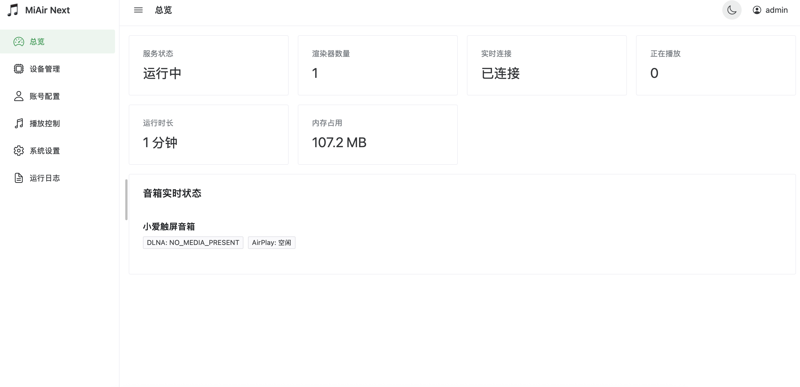

# MiAir Next

让小米小爱音箱化身 **DLNA 渲染器** 与 **AirPlay 接收器**，并附带一个现代化的 Web 管理后台。

本项目在 [MiAir](https://github.com/KiriChen-Wind/MiAir) 协议层的基础上重构：后端改用 **FastAPI**，前端使用 **Vue 3 + Vite + Naive UI** 自建轻量管理后台，通过 GitHub Actions 云端构建多架构 Docker 镜像，一条命令即可部署。



---

## ✨ 功能

- **DLNA (UPnP AV)**：把小爱音箱注册为可投送的媒体渲染器，支持网易云音乐、QQ 音乐等 App 投送。
- **AirPlay**：作为 AirPlay 接收器，支持 iPhone / Mac 音频投送（FairPlay / HAP 配对）。
- **小米云控制**：通过小米账号 API 控制音箱播放、音量、状态查询。
- **Web 管理后台**：登录鉴权、总览面板（WebSocket 实时推送）、设备管理、播放控制、账号配置、系统设置、运行日志、暗色模式。
- **热重启子服务**：保存配置后热重启 DLNA/AirPlay，无需重启整个进程。

---

## 🚀 快速开始（Docker，推荐）

> ⚠️ **必须使用 host 网络**：DLNA/AirPlay 依赖组播发现，仅支持 **Linux 宿主机**。详见[部署文档](docs/deployment.md)。

一键安装：

```bash
curl -fsSL https://raw.githubusercontent.com/deerwan/miair-next/main/install.sh | bash
```

或 docker run：

```bash
docker run -d \
  --name miair-next \
  --network host \
  --restart unless-stopped \
  -e MIAIR_WEB_PORT=8300 \
  -v $(pwd)/data:/app/data \
  mrdeer1997/miair-next:latest
```

启动后访问 `http://<宿主机IP>:8300`，首次访问将引导创建管理员账号，登录后在「账号配置」中填入小米账号 / Cookie 并选择音箱。

---

## 📚 文档

| 文档 | 内容 |
| --- | --- |
| [部署与配置](docs/deployment.md) | 安装方式、manage.sh 管理脚本、镜像标签策略、数据目录、环境变量、升级 |
| [接口文档](docs/api.md) | REST / WebSocket 接口清单、鉴权说明、快速验证 |
| [本地开发](docs/development.md) | 前后端启动、测试、构建镜像、发版流程、项目结构 |

---

## 🙏 致谢

协议层实现移植并改造自 [MiAir](https://github.com/KiriChen-Wind/MiAir)。

部分实现参考 [songloft-plugin-miot](https://github.com/songloft-org/songloft-plugin-miot)。

感谢 [LINUX DO](https://linux.do/) 社区。

